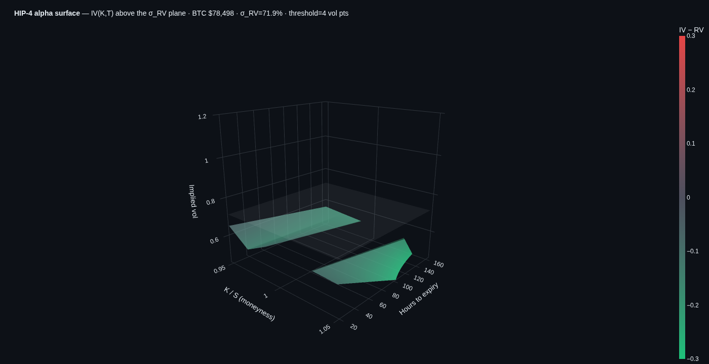
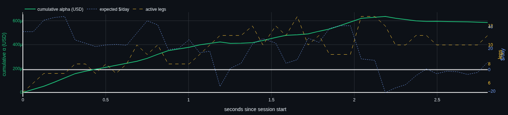

# HIP-4 Animated Alpha Surface

Statistical-arbitrage dashboard between Hyperliquid HIP-4 outcome markets
and BTC perp. The surface animates in real time and re-renders on every
slider change, so generated alpha is visible the moment a variable moves.




## The thesis

HIP-4 outcome contracts pay $1 if `BTC > K` at expiry, else 0. Their
mid-price is therefore the risk-neutral probability `P(S_T > K)`. Inverting
that probability under GBM gives an **implied volatility** `σ_imp`. The
BTC perpetual tape gives a **realised volatility** `σ_rv`. The trade:

```
   if σ_imp < σ_rv − threshold     →   LONG  outcome,  SHORT  BTC perp delta
   if σ_imp > σ_rv + threshold     →   SHORT outcome,  LONG   BTC perp delta
```

The book is delta-neutralised every tick using the digital delta
`Δ = n(d₂)/(S σ √T)`. Expected daily P&L per position is the standard
gamma-carry formula

```
   E[P&L/day] = ½ · Γ · S² · (σ_rv² − σ_imp²) / 365
```

## The animated surface

3D plot, refreshed on every tick:

| Axis | Meaning |
|---|---|
| X | moneyness `K / S` |
| Y | hours to expiry |
| Z | implied volatility |
| color | `σ_imp − σ_rv` mapped diverging green ↔ red |
| reference plane | `σ_rv` (white, transparent) |

Sliders re-render the surface instantly:

- **RV window** (5–180 min) — period of the BTC perp tape used for `σ_rv`
- **Threshold** (0.5–30 vol pts) — minimum gap before a position is taken
- **Hedge ratio** (0×–2×) — multiplier on the digital delta when sizing
  the perp hedge

A ▶ Play button animates through the last 60 ticks; the time slider scrubs
through history. Below the surface a P&L panel shows cumulative
theoretical alpha, $/day, and active legs over the session.

## Run

```bash
pip install -r requirements.txt

# Live (uses HYPERLIQUID_USER_ADDRESS for user-state reads;
# HYPERLIQUID_API_WALLET_KEY would gate execution if enabled):
export HYPERLIQUID_USER_ADDRESS=0xYourAddress
export HYPERLIQUID_API_WALLET_KEY=0xPrivateKeyOfYourApiSubaccount
python -m src.app

# Replay a CSV captured offline by you (see below):
python -m src.app --csv data/

# Pure offline demo (drifting synthetic universe):
python -m src.app --no-live
```

Open http://127.0.0.1:8050.

## Data capture (local, for the user only)

`scripts/fetch_hl.py` is a stdlib-only script that polls the public
Hyperliquid info endpoint and writes two CSVs (`outcomes.csv`,
`perp.csv`) into `--out-dir`. Run it on a host with internet access and
hand the directory to the dashboard via `--csv`:

```bash
python scripts/fetch_hl.py --out-dir data/ --interval 5 --duration 600
```

This is **not** how the production system runs — only how you pre-capture
a tape for replay/development. The dashboard itself talks straight to
`api.hyperliquid.xyz` once `HYPERLIQUID_USER_ADDRESS` is set.

## Layout

```
src/
  hl_client.py     /info client; reads outcomeMeta, l2Book, allMids
  contracts.py     BinaryMarket / TernaryMarket
  pricing.py       prob_above, iv_from_prob, digital Δ/Γ/Vega, carry
  statarb.py       IV-vs-RV signal → direction, hedge, expected $/day
  feed.py          orchestrates client / CSV / simulator + history
  simulator.py     drifting synthetic universe (offline mode)
  data_loader.py   CSV replay
  surface.py       animated 3D surface + cumulative-alpha panel
  app.py           Dash entrypoint with sliders
scripts/
  fetch_hl.py      stdlib-only data capture (you run, dashboard replays)
  smoke.py         end-to-end check
```
